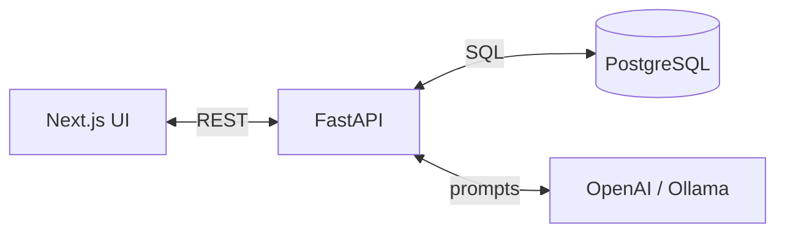
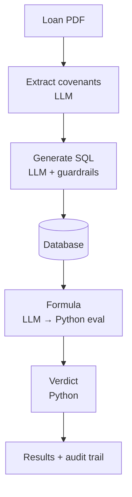
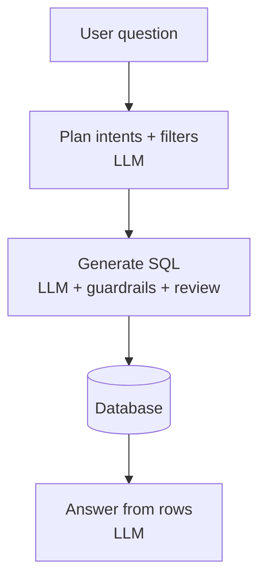

# Loan Covenant Monitor

Upload a loan agreement PDF, pick a borrower and month, and see whether each covenant is **compliant**, **warning**, or **breached**. Ask questions about the borrower data in plain English.

**Stack:** Next.js · FastAPI · PostgreSQL (Neon) · OpenAI or Ollama

The LLM extracts covenants, writes SQL, and picks formulas. Python runs the SQL guardrails, evaluates the math, and decides the verdict — nothing unverified is reported as fact.

---

## Architecture



### Covenant check



Each covenant runs **P1 → P2 → P3** in parallel. Guardrails: SELECT only, whitelisted tables, `LIMIT 100`.

### Ask the data (chat)



Answers use only retrieved rows. Filters from the question must appear in the SQL.

---

## Run locally

```bash
# Backend
python -m venv .covenat_monitor && source .covenat_monitor/bin/activate
pip install -r requirements.txt
cp .env.example .env   # set DATABASE_URL, OPENAI_API_KEY
python scripts/seed_database.py
python -m uvicorn app.main:app --reload

# Frontend (new terminal)
cd frontend && cp .env.local.example .env.local && npm install && npm run dev
```

- UI: http://localhost:3000  
- API docs: http://localhost:8000/docs  

Use `samples/loan_agreement_sample.pdf`, **borrower_001**, period **2026-07**.

---

## Deploy (free)

| Part | Host | URL you open |
|------|------|----------------|
| UI | [Vercel](https://vercel.com) — root dir `frontend` | Your Vercel app |
| API | [Render](https://render.com) — use `render.yaml` | Backend only (not the website) |

**Vercel:** `NEXT_PUBLIC_API_URL=https://your-api.onrender.com` (no trailing slash) → redeploy.

**Render:** `DATABASE_URL`, `OPENAI_API_KEY`, `CORS_ORIGINS=https://your-app.vercel.app`

Render free tier sleeps after ~15 min idle; first request may take ~1 minute.

---

## Environment

| Backend (`.env`) | Purpose |
|------------------|---------|
| `DATABASE_URL` | Postgres connection |
| `OPENAI_API_KEY` | LLM (when `LLM_PROVIDER=openai`) |
| `LLM_PROVIDER` | `openai` (default) or `ollama` |
| `CORS_ORIGINS` | Frontend URL(s), comma-separated |

| Frontend (`.env.local`) | Purpose |
|-------------------------|---------|
| `NEXT_PUBLIC_API_URL` | FastAPI base URL |

---

## Main API routes

| Path | What it does |
|------|----------------|
| `POST /covenants/analyze` | PDF + borrower + period → full check |
| `POST /chatwithdata` | Question over borrower data |
| `GET /tables`, `/borrowers` | Data browser |
| `GET /health` | Status check |

---

## LaTeX diagrams

For a PDF/portfolio figure, compile `docs/pipeline-architecture.tex` and add the image to the README if you prefer TikZ over Mermaid.

## License

MIT
