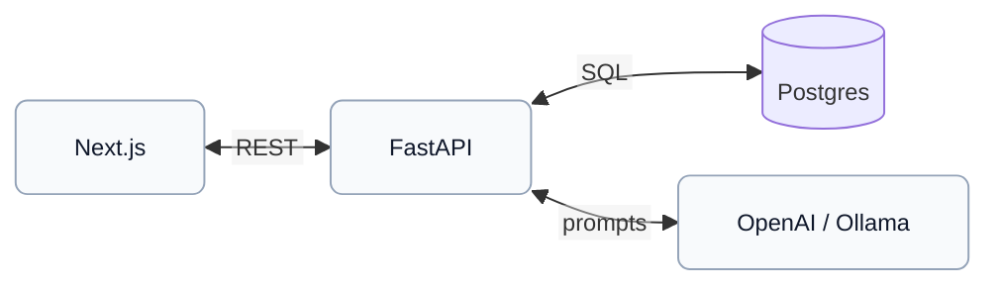
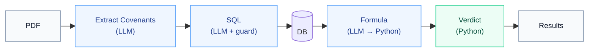
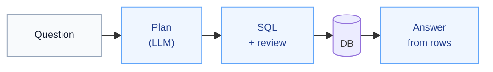

# Loan Covenant Monitor and Chat With Database

Upload a loan agreement PDF, pick a borrower and month, and see whether each covenant is **compliant**, **warning**, or **breached**. Also ask questions about the borrowers data in plain English.

**Live demo:** [UI](https://covenant-compliance-bice.vercel.app) · [API docs](https://covenant-compliance-api.onrender.com/docs) · [Health](https://covenant-compliance-api.onrender.com/health)

**Stack:** Next.js · FastAPI · PostgreSQL (Neon) · OpenAI or Ollama (For Personal Deployment)

---

## Features

**Covenant check:** Upload a loan agreement PDF, choose a borrower and reporting month, and the system walks through every financial covenant it finds. It pulls the right numbers from the database, applies the covenant formula, and labels each rule as compliant, warning, or breached, with an audit trail you can open to fact check the process.

**Chat with data:** Ask everyday questions about the portfolio (“Who has the lowest DSCR?” or “What was X Company’s cash in July 2026?”). The app plans what to look up, runs safe SQL against the borrower and financial snapshot tables, and answers in plain English using only the rows it actually retrieved.

**Trust boundary:** The language model is used for reading documents, drafting SQL, and suggesting formulas. It does not get the final say. Python checks every query, evaluates the math on real database values, and decides the compliance status so invented numbers never show up as fact.

---

## Architecture



### Covenant check



**Walkthrough:** The LLM extracts covenants from the loan agreement, writes SQL for the needed financials, and picks a formula. Python runs SQL guardrails, evaluates the math on returned rows, and decides the verdict to make sure nothing unverified is reported as fact.

**Tech:** `POST /covenants/analyze`. After extraction, each covenant runs **SQL → formula → verdict** in parallel (one DB session per covenant) for saving time. **Guardrails:** `SELECT` only, tables `borrowers` / `financial_snapshots`, `LIMIT 100`. Formulas are evaluated with a safe Python AST. Statuses: `compliant` · `warning` · `breached` · `insufficient_data` · `manual_review`.

### Ask the data



**Walkthrough:** The planner turns the question into intents and filters. SQL is generated, checked against those filters, then executed. The answer is narrated only from retrieved rows, no invented numbers.

**Tech:** `POST /chatwithdata`. Same SQL whitelist and `LIMIT 100`. A review step checks that filters from the question appear in the SQL before results are used. Up to a few retrieval intents per turn; the answer prompt is grounded on returned rows only.

---

## Run locally

**Prerequisites:** Python 3.11+, Node 18+, a Postgres URL (e.g. [Neon](https://neon.tech)), and an OpenAI key (or a local [Ollama](https://ollama.com) model).

### 1. Backend

```bash
python -m venv .covenat_monitor
source .covenat_monitor/bin/activate   # Windows: .covenat_monitor\Scripts\activate

pip install -r requirements.txt
cp .env.example .env                   # set DATABASE_URL and OPENAI_API_KEY

python scripts/seed_database.py
python -m uvicorn app.main:app --reload --port 8000
```

API: [http://localhost:8000/docs](http://localhost:8000/docs)

### 2. Frontend (new terminal)

```bash
cd frontend
cp .env.local.example .env.local       # NEXT_PUBLIC_API_URL=http://localhost:8000
npm install
npm run dev
```

UI: [http://localhost:3000](http://localhost:3000)

### Try the demo

Use `samples/loan_agreement_sample.pdf` with any borrower and period **`2026-07`**.

---

## Environment

### Backend (`.env`)

| Variable                           | Purpose                                                  |
| ---------------------------------- | -------------------------------------------------------- |
| `DATABASE_URL`                     | Postgres connection string                               |
| `OPENAI_API_KEY`                   | Required when `LLM_PROVIDER=openai`                      |
| `LLM_PROVIDER`                     | `openai` (default) or `ollama` (for personal deployment) |
| `OPENAI_MODEL`                     | Default `gpt-4o-mini`                                    |
| `CORS_ORIGINS`                     | Frontend origin(s), comma-separated                      |
| `OLLAMA_BASE_URL` / `OLLAMA_MODEL` | Used when `LLM_PROVIDER=ollama`                          |

### Frontend (`frontend/.env.local`)

| Variable              | Purpose          |
| --------------------- | ---------------- |
| `NEXT_PUBLIC_API_URL` | FastAPI base URL |

---

## Main API routes

| Method | Path                        | Purpose                                         |
| ------ | --------------------------- | ----------------------------------------------- |
| `POST` | `/covenants/analyze`        | PDF + borrower + period → full compliance check |
| `POST` | `/chatwithdata`             | Question over borrower data                     |
| `GET`  | `/borrowers`                | List borrowers                                  |
| `GET`  | `/tables`, `/tables/{name}` | Browse whitelisted tables                       |
| `GET`  | `/health`                   | Status + LLM provider info                      |

---

## Project layout

```text
app/           FastAPI — covenants, chat, SQL guardrails, LLM providers
frontend/      Next.js UI
scripts/       Seed data + pipeline smoke tests
samples/       Demo loan agreement PDF
alembic/       DB migrations
```
